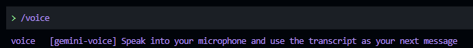
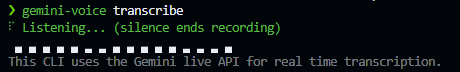

# Gemini CLI Voice Extension

**Voice mode for [Gemini CLI](https://github.com/google-gemini/gemini-cli).** Talk to Gemini from your terminal, powered by the Gemini Live API.



This repo ships two things:

- **`gemini-voice` CLI**, a standalone voice real-time transcription tool in the terminal with an audio waveform display. It captures speech from your microphone, streams it to the Gemini Live API, and returns a transcript.
- **Gemini CLI Extension**, which adds a `/voice` command to Gemini CLI so you can speak instead of type.

The CLI was built first as the core transcription engine, and the extension wraps it to bring voice input into Gemini CLI. Think of it like voice mode for Claude Code, but for Gemini CLI.



### Current limitations

The extension approach works, but Gemini CLI's extension system has some constraints that limit the experience:

- **No push-to-talk.** You need to type `/voice` (or use your OS voice-to-text) to start listening. There's no hotkey to hold and talk.
- **No live feedback.** The standalone `gemini-voice` CLI shows a real-time audio waveform, but Gemini CLI doesn't support live output from extension subprocesses, so the interactive UI is suppressed when used as an extension.

These are platform limitations, not bugs. To get a true voice mode with push-to-talk, live waveforms, and tight integration, it needs to be built natively into Gemini CLI itself. I'm working on that, and this project is a stepping stone towards it, built on top of the Gemini Live API.

## Features

- Voice input for Gemini CLI via the `/voice` extension command
- Native microphone capture via a Rust addon (cpal + lock-free ring buffer)
- Real-time audio streaming to the Gemini Live API for transcription
- Server-side voice activity detection (VAD), no local VAD needed
- Automatic shutdown after speech ends
- Ink-based terminal UI with spinner and live audio level meter (standalone CLI)
- Standalone CLI with `transcribe` and `devices` subcommands
- Pre-built native binaries, no Rust toolchain needed for end users

## How it works

The Gemini Live API is actually a speech-to-speech API designed for real-time voice conversations with the model. We're repurposing it here, only using its real-time input transcription and server-side voice activity detection to build a transcription tool. The model's audio responses are ignored entirely.

1. The native Rust addon captures 16kHz 16-bit PCM mono audio from the microphone using cpal
2. Audio samples are written to a lock-free ring buffer and drained on a dedicated thread
3. The drain thread pushes samples into Node.js via a NAPI ThreadsafeFunction (non-blocking)
4. TypeScript code base64-encodes the PCM chunks and sends them as `realtimeInput` over a WebSocket to the Gemini Live API
5. The server performs voice activity detection and streams back `inputTranscription` messages
6. Once transcription is complete (or a settle timeout elapses), the transcript is printed to stdout and the process exits

## Prerequisites

- [Gemini CLI](https://github.com/google-gemini/gemini-cli)
- [Node.js](https://nodejs.org/) (v18+)
- A Gemini API key ([get one here](https://aistudio.google.com/apikey))

## Installation

### As a Gemini CLI extension

From GitHub:

```bash
gemini extensions install https://github.com/kstonekuan/gemini-cli-voice-extension
```

From npm:

```bash
gemini extensions install @kstonekuan/gemini-voice
```

Set up your API key:

```bash
gemini-voice auth
```

### Standalone CLI

```bash
npm install -g @kstonekuan/gemini-voice
gemini-voice auth
```

### Development

See [CONTRIBUTING.md](./CONTRIBUTING.md) for development setup.

## Usage

### Inside Gemini CLI

```
/voice
```

### Standalone CLI

```bash
# Transcribe speech from the default microphone
gemini-voice transcribe

# Transcribe from a specific audio device
gemini-voice transcribe --device 1

# Quiet mode -- only output the final transcript (no UI)
gemini-voice transcribe --quiet

# List available audio input devices
gemini-voice devices
```

> **Note:** When using `/voice` inside Gemini CLI, the `--quiet` flag is used automatically. Gemini CLI's `!{...}` syntax does not support live output from subprocesses, so the interactive UI is suppressed. The model will echo back the transcription before responding.

Press `Ctrl+C` to cancel at any time.
